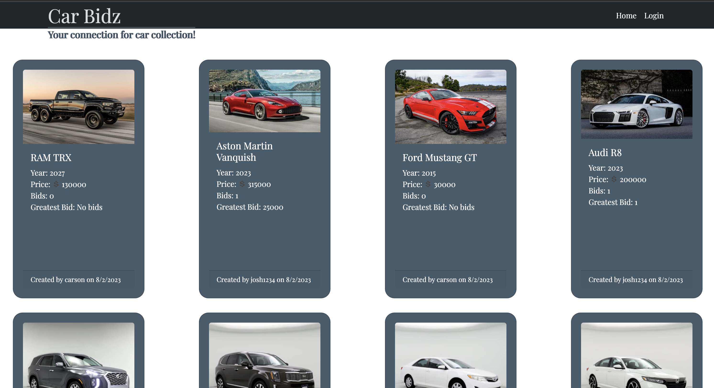
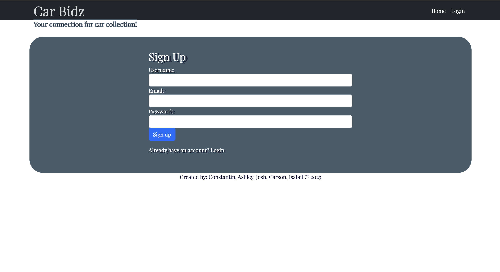
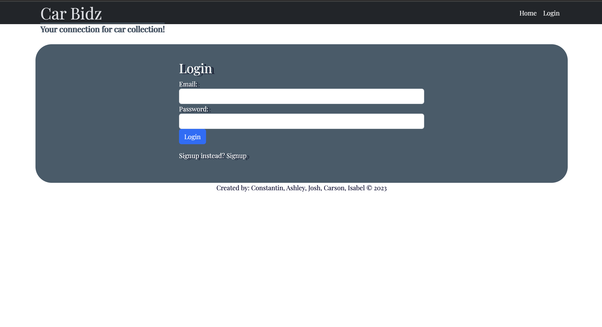
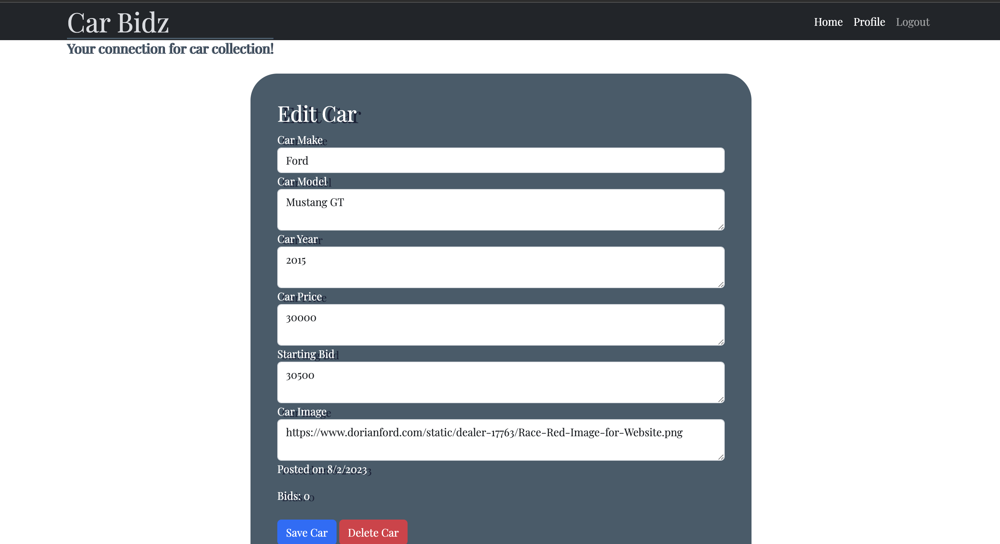

# Car Bidz

## User Story

As a car dealer,

I want to have an easy way to access cars up for auction.

So that I can easily see various types of cars for sale,

I want to see details of these cars.

So that I can select the next car to add to my collection,

I want to also auction cars,

So that I can easily post them and make them easy to read.


## Description

- This is an application that allows car buyers to search for cars according to make, model, and year. Users will be able to purchase cars in the form of bids.

## Installation

```npm i```

```mysql -u root -p```

```SOURCE db/schema.sql```

```npm run seeds```

Application should be running under the localhost once these methods are followed. 

If you are wanting to use the live application:
Click on the deployment link and the application will open. 

## Usage

Screenshots: 









- After clicking on the deployed link, the application will open up to a homepage that allows the user to either login or sign up. After logging in, the user will be taken to a page that displays a catalog of cars available. In the sidebar of this page, the user will be able to filter the kind of car they are looking for according to make, model, and year. The body of the page will display a catalog of cars that shows an image of the car, the make, the model, the year, and the price. In every card, there is an option for the user to "make a bid" in the form of a comment and the highest bid will appear at the top.


## Credits

- List of collaborators:

1. https://github.com/jheeebert

2. https://github.com/carsonjames1125

3. https://github.com/KEINance

4. https://github.com/c0nstantin1990

5. https://github.com/ashleyemfernandez

## License

MIT License

Copyright (c) [2023] [car-bidz-group]

Permission is hereby granted, free of charge, to any person obtaining a copy
of this software and associated documentation files (the "Software"), to deal
in the Software without restriction, including without limitation the rights
to use, copy, modify, merge, publish, distribute, sublicense, and/or sell
copies of the Software, and to permit persons to whom the Software is
furnished to do so, subject to the following conditions:

The above copyright notice and this permission notice shall be included in all
copies or substantial portions of the Software.

THE SOFTWARE IS PROVIDED "AS IS", WITHOUT WARRANTY OF ANY KIND, EXPRESS OR
IMPLIED, INCLUDING BUT NOT LIMITED TO THE WARRANTIES OF MERCHANTABILITY,
FITNESS FOR A PARTICULAR PURPOSE AND NONINFRINGEMENT. IN NO EVENT SHALL THE
AUTHORS OR COPYRIGHT HOLDERS BE LIABLE FOR ANY CLAIM, DAMAGES OR OTHER
LIABILITY, WHETHER IN AN ACTION OF CONTRACT, TORT OR OTHERWISE, ARISING FROM,
OUT OF OR IN CONNECTION WITH THE SOFTWARE OR THE USE OR OTHER DEALINGS IN THE
SOFTWARE.

## Badges

n/a

## Links
1. Heroku:
    - https://car-bidz-d6af66a79b60.herokuapp.com/
2. Github Repo:
    - https://github.com/c0nstantin1990/car-bidz